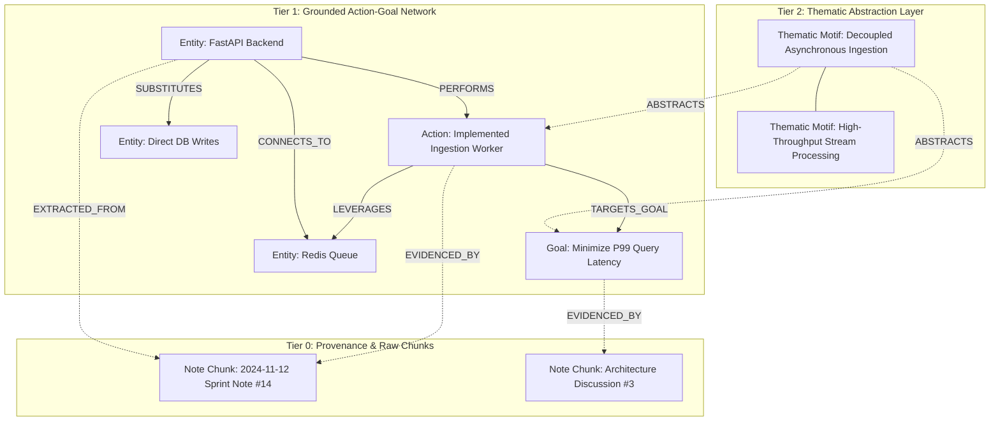
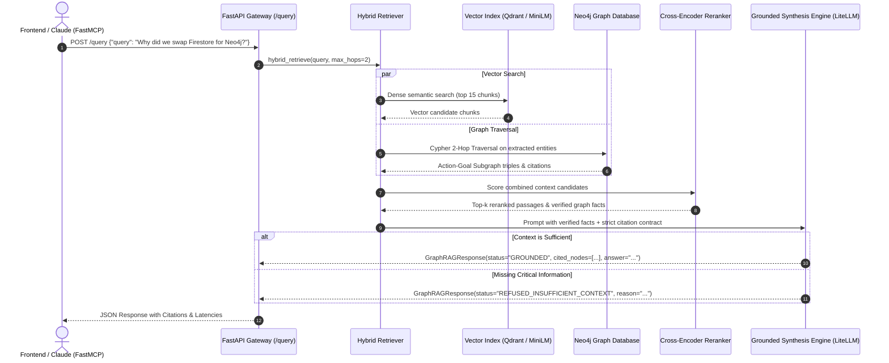

# Liminal: Multi-Edge Intent-Aware GraphRAG Specification
**Document Version:** 1.0.0  
**Status:** Approved for Implementation  
**Target Architecture:** Grounded Hybrid Multi-Edge GraphRAG + FastMCP + CI Eval Gate  
**Target Repository:** `https://github.com/KaiwalPanchal/liminalfinal`

---

## 1. Executive Summary & Vision

Traditional Retrieval-Augmented Generation (RAG) suffers from three fundamental bottlenecks:
1. **Flat Naive Chunking:** Splits unstructured text by arbitrary character counts, destroying cross-document relationship context.
2. **Static Surface Relationships:** Standard knowledge graphs only capture static noun pairs (e.g., `(Kafka)-[:IS_A]->(MessageQueue)`), losing the operational *action*, the *motive/why*, and the *causal outcome*.
3. **No Generalization / Abstraction:** Systems retrieve either too specific historical instances (noisy details) or generic hallucinations, unable to separate situational variables from universal problem-solving motifs.

**Liminal** solves this by establishing a **Multi-Edge, Multi-Tier Dynamic Knowledge Graph**:
- **Multi-Edge Topology:** Multiple concurrent, directed, typed relations between entities (e.g., `USES_FOR`, `COLLABORATES_WITH`, `SUBSTITUTES`, `BLOCKED_BY`).
- **Action-Goal-Motive Triads:** Capturing not just *what* happened, but *how* and *why* it was done (`(Entity)-[:PERFORMS]->(Action)-[:TARGETS_GOAL]->(Goal)` with `motive` and `rationale`).
- **3-Tier Abstraction Hierarchy:** Deconstructing notes from raw text (Tier 0) into grounded action triples (Tier 1) and generalized conceptual motifs (Tier 2).
- **SCAMPER Innovation Framework:** Systematic transformation operators applied to NLP retrieval and knowledge exploration.
- **Deterministic Grounding & Evals:** Strict Pydantic v2 schemas requiring cited graph node IDs, an offline 30-case multi-hop evaluation benchmark, and FastMCP server tooling for IDE integration.

---

## 2. Graph Data Model & Schema Architecture

### 2.1 Multi-Tier Abstraction Hierarchy



### 2.2 Node Type Definitions

| Label | Primary Properties | Description |
|---|---|---|
| `:Entity` | `id`, `name`, `type` (Person, Tool, Concept, System, Metric), `aliases`, `summary`, `created_at` | Nouns extracted via NER representing distinct actors, systems, or entities. |
| `:Action` | `id`, `verb`, `description`, `timestamp`, `status` (Planned, InProgress, Completed, Deprecated) | Operational actions or events undertaken by entities. |
| `:Goal` | `id`, `objective`, `motive` ("Why"), `criteria` ("How measured"), `domain` | The teleological target or motive behind an action. |
| `:ThematicMotif` | `id`, `pattern_name`, `abstract_rule`, `domains` | Higher-level generalized pattern created by stripping instance-specific variables. |
| `:NoteChunk` | `id`, `note_id`, `chunk_index`, `raw_text`, `embedding_id`, `created_at` | Immutable raw text provenance node for deterministic verification. |

### 2.3 Multi-Edge Typed Relationships

Between any two `:Entity` nodes (or between `:Entity`, `:Action`, and `:Goal`), multiple directed edges can coexist:

```cypher
// 1. Operational & Architectural Relationships
(e1:Entity)-[:USES_FOR {action: "vector_indexing", frequency: 12}]->(e2:Entity)
(e1:Entity)-[:SUBSTITUTES {tradeoff: "lower latency, higher memory"}]->(e2:Entity)
(e1:Entity)-[:BLOCKED_BY {obstacle: "Schema migration delay"}]->(e2:Entity)
(e1:Entity)-[:COLLABORATES_WITH {project: "Liminal GraphRAG"}]->(e2:Entity)

// 2. Action - Goal - Motive Triad
(e:Entity)-[:PERFORMS {role: "Lead Implementer"}]->(a:Action)
(a:Action)-[:TARGETS_GOAL {priority: "P0", confidence: 0.95}]->(g:Goal)
(a:Action)-[:MOTIVATED_BY {why: "Prevent cascade failure during spike"}]->(g:Goal)
(a:Action)-[:LEVERAGES]->(tool:Entity)

// 3. Provenance & Abstraction Links
(a:Action)-[:EVIDENCED_BY {char_start: 120, char_end: 280}]->(c:NoteChunk)
(m:ThematicMotif)-[:ABSTRACTS {abstraction_confidence: 0.91}]->(a:Action)
(m:ThematicMotif)-[:GENERALIZES]->(g:Goal)
```

---

## 3. The SCAMPER Framework Applied to NLP & GraphRAG

The SCAMPER technique (Substitute, Combine, Adapt, Modify, Put to another use, Eliminate, Reverse) is applied systematically across the pipeline:

| SCAMPER Lens | Algorithmic Implementation in Liminal | Technical Value / Benchmark Impact |
|---|---|---|
| **Substitute** | Replace naive cosine similarity over raw chunks with **Hybrid Dense + Cypher Multi-Hop Traversal + Cross-Encoder Reranking**. | Eliminates chunk boundary blindness; guarantees retrieval of 2-hop connected dependencies. |
| **Combine** | Fuse **BM25 lexical search**, **Sentence-Transformers dense vectors**, and **Neo4j graph topologies** into a unified candidate pool. | Overcomes vocabulary mismatch while retaining exact keyword precision for entity names. |
| **Adapt** | Adapt Microsoft GraphRAG / LightRAG dual-level hierarchy to **Action-Goal Motive Networks** ("Why did you do it?"). | Enables answers to strategic queries ("Why did we choose Neo4j over Postgres?"). |
| **Modify / Magnify** | Weight graph traversal edges by **Intent Centrality** and **Citation Recency** rather than raw co-occurrence frequency. | Prevents high-degree stop-word entities from dominating retrieval subgraphs. |
| **Put to Another Use** | Expose the graph directly to AI agents (Claude Desktop / Cursor) via **FastMCP** server tools (`search_knowledge_graph`, `query_by_goal`). | Turns passive note storage into an interactive external memory tool for developer workflows. |
| **Eliminate** | Prune low-confidence relationships ($< 0.70$) and eliminate hallucinations via **deterministic refusal schema** (`REFUSED_INSUFFICIENT_CONTEXT`). | Guarantees precision $\ge 95\%$ on unanswerable and out-of-domain queries. |
| **Reverse** | **Teleological Reverse Retrieval**: Search from `Goal` $\to$ `Actions` that achieved it $\to$ `Entities` used, allowing users to reverse-engineer past successful strategies. | Enables queries like "Find all past actions taken to reduce API latency below 100ms". |

---

## 4. End-to-End System Architecture



---

## 5. Ingestion Pipeline & NER Action-Relation Extraction

When a note is created or updated in the frontend (Yoopta Editor):
1. **Text Extraction & Normalization:** Yoopta JSON or Markdown is converted to clean text blocks with paragraph-level provenance markers.
2. **Chunking with Sliding Window:** 500-token chunks with 50-token overlap, indexed into the vector store.
3. **Intent-Aware Extraction Prompt:**
   ```json
   {
     "entities": [
       {"name": "Neo4j", "type": "Tool", "description": "Graph database"}
     ],
     "actions": [
       {"verb": "Migrated", "description": "Migrated from Firestore to Neo4j", "status": "Completed"}
     ],
     "goals": [
       {"objective": "Sub-100ms multi-hop traversal", "motive": "Firestore required client-side joins that timed out at 3 hops"}
     ],
     "relations": [
       {"source": "Liminal Backend", "target": "Neo4j", "relation": "USES_FOR", "details": "Knowledge graph queries"},
       {"source": "Migrated", "target": "Sub-100ms multi-hop traversal", "relation": "TARGETS_GOAL", "details": "Achieve relational speed"}
     ],
     "abstract_motifs": [
       "Database migration from document to graph model to eliminate N+1 join latency"
     ]
   }
   ```
4. **Idempotent Cypher Merge:** Entities are merged by normalized lowercase name; multi-edges are created with unique action IDs to prevent duplicates.
5. **Thematic Clustering:** Level 2 `:ThematicMotif` nodes group similar actions across different projects using cosine distance on action-goal embeddings.

---

## 6. Grounded API Contract (Pydantic v2)

Located in `backend/app/core/models.py`:

```python
from typing import List, Literal, Optional
from pydantic import BaseModel, Field

class CitedEntity(BaseModel):
    node_id: str = Field(..., description="Unique graph node ID")
    entity_name: str = Field(..., description="Canonical entity name")
    entity_type: str = Field(..., description="Node label: Entity, Action, Goal, or Motif")
    hop_level: int = Field(default=1, description="Graph distance from query anchor")

class GraphRAGQueryRequest(BaseModel):
    query: str = Field(..., min_length=3, description="User question or research query")
    max_hops: int = Field(default=2, ge=1, le=3, description="Graph expansion radius")
    top_k: int = Field(default=5, ge=1, le=20, description="Reranked context budget")
    filter_by_goal: Optional[str] = Field(None, description="Optional teleological filter")

class GraphRAGResponse(BaseModel):
    answer: str = Field(..., description="Synthesized grounded answer or refusal explanation")
    status: Literal["GROUNDED", "REFUSED_INSUFFICIENT_CONTEXT"] = Field(...)
    confidence_score: float = Field(..., ge=0.0, le=1.0)
    cited_nodes: List[CitedEntity] = Field(default_factory=list)
    cited_passages: List[str] = Field(default_factory=list)
    retrieval_latency_ms: float
    generation_latency_ms: float
```

---

## 7. FastMCP Tooling Specification

Located in `backend/mcp/server.py`:
- `search_knowledge_graph(query: str, top_k: int = 5) -> dict`: Queries the hybrid index and returns formatted passages with cited graph nodes.
- `get_entity_connections(entity_name: str, max_hops: int = 2) -> dict`: Returns the multi-edge neighborhood (actions, goals, and collaborators) for any entity.
- `explore_thematic_motifs(domain: str) -> dict`: Returns high-level abstracted problem-solving patterns stripped of specific project noise.
- `query_by_intent(goal_objective: str) -> dict`: Reverse-queries past actions, motivations, and tools used to achieve a specific outcome.

---

## 8. Evaluation Benchmark & CI Quality Gate

### 8.1 Golden Benchmark (`backend/tests/evals/golden_qa.jsonl`)
- **Size:** 30 hand-labeled test cases.
- **Coverage:**
  - 12 Multi-Hop Relationship Queries (require traversing 2+ edges)
  - 8 Action-Goal Motive Queries ("Why did X perform Y?")
  - 4 Thematic Abstraction Queries ("What recurring pattern was used for Z?")
  - 6 Adversarial / Out-of-Domain Queries (Must produce `REFUSED_INSUFFICIENT_CONTEXT`)

### 8.2 Pass/Fail Regression Thresholds (`backend/tests/evals/run_evals.py`)
- **Context Recall:** $\ge 85\%$ (Ground-truth nodes present in retrieved context)
- **Refusal Precision:** $\ge 95\%$ (Correctly refuses unanswerable queries with zero hallucination)
- **Execution:** Ran automatically on PRs via `.github/workflows/eval_gate.yml`. Any regression exits with code `1` and blocks merge.

---

## 9. Implementation Roadmap

1. **Phase 1: Hygiene & Security Remediation** (Remove `firebase-debug.log`, parameterize API URLs, replace hardcoded auth).
2. **Phase 2: Python FastAPI Backend & Hybrid GraphRAG** (Cypher queries, Neo4j driver, Qdrant/MiniLM, reranker, grounded synthesis).
3. **Phase 3: FastMCP Server Integration** (Standard input/output MCP server for Cursor and Claude Desktop).
4. **Phase 4: Offline Evaluation Suite & CI Gate** (`golden_qa.jsonl`, `run_evals.py`, GitHub Actions workflow).
5. **Phase 5: Full Containerization & Documentation** (`docker-compose.yml`, `.env.example`, comprehensive `README.md`).
