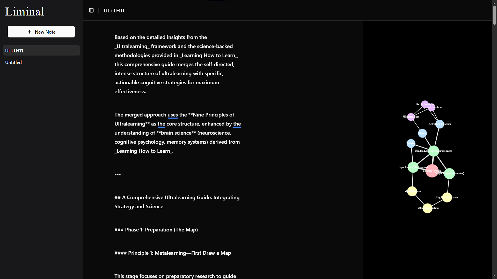

Liminal — Dynamic Knowledge Graph + Smart Notes + Project Management

Liminal is a productivity and knowledge-management system designed to help you remember everything you encounter and connect ideas automatically.
It transforms notes, quotes, audio, PDFs, and shared content into a multi-layer dynamic knowledge graph, revealing relationships, patterns, and insights that traditional note-taking apps can’t.

Liminal makes your knowledge searchable, connected, and actionable, while also helping you manage projects rooted in that knowledge.

## Screenshots

### Homescreen


### Formatting Options


## Project Motivation & Core Innovation

Liminal was conceived to address a common challenge: retaining and effectively utilizing information from extensive reading and research. The initial problem was simply remembering what was consumed. However, this evolved into a more complex task: how to retrieve information relevant to current thoughts and projects from years of accumulated knowledge. Inspired by methodologies like the Zettelkasten method and Tiago Forte's "Building a Second Brain," the core motivation was to leverage machine learning to make knowledge searchable, connected, and actionable.

The project's innovation lies in its ability to go beyond simple note-taking to build a dynamic, multi-layer knowledge graph that truly mirrors a "second brain." This is achieved by:
*   **Deep Semantic Understanding:** Employing Named Entity Recognition (NER) and advanced techniques to identify not just entities, but also the nuanced *action-relationships* between them.
*   **Abstraction and Theme Discovery:** Automatically identifying underlying themes and patterns, abstracting away specific details to reveal higher-level concepts and connections.
*   **Intent Capture:** Uniquely focusing on the *motive* or *goal* behind actions and information ("why" it matters), thereby enriching the knowledge graph with critical context.
*   **Structured Innovation:** The development process itself was guided by creative thinking techniques like SCAMPER, ensuring continuous exploration of new functionalities and enhancements.

## Technical Details

Liminal leverages a robust technical stack to achieve its goals:

*   **Backend:** Developed with **FastAPI**, serving as the core API layer. It integrates with **Neo4j** for dynamic knowledge graph storage and querying, and **Firestore** for managing structured data like user profiles and project information.
*   **Frontend:** Built using **Next.js** for web applications, with an eye towards **React Native** for potential mobile experiences, offering a consistent and responsive user interface.
*   **NLP Processing:** Utilizes advanced LLM capabilities, dynamically switching between **Ollama** (for local processing, especially with GPU availability) and **OpenAI** (for cloud-based processing) to handle natural language understanding, entity extraction, and embeddings. The knowledge graph is constructed through sophisticated NLP techniques, including Named Entity Recognition (NER), action-relationship extraction, theme discovery, and abstraction, inspired by methods like a modified **LightRAG** implementation.
*   **Storage:** Persistent data is managed across several solutions:
    *   **Persistent cloud disks** for storing large files (audio, PDFs, etc.).
    *   **Neo4j** specifically for the complex interconnections of the knowledge graph.
    *   **Firestore** for scalable storage of user and project-related structured data.
*   **Deployment:** The project was initially hosted on **Google Cloud Platform (GCP)**.

## Role & Status

I was the **sole creator** for Liminal, responsible for the entire project lifecycle from ideation, design, full-stack development (backend with FastAPI, frontend with Next.js), and the integration of machine learning components. While familiar with backend development, I utilized AI tools for basic frontend integration.

A significant technical challenge involved implementing the graph-based data structures and their categorization, an area I was less familiar with. This was overcome by deep-diving into the documentation of Microsoft's GraphRAG and the original LightRAG implementation, and subsequently modifying prompts to better understand the complex relationships between entities, actions, themes, and concepts.

Please note that the backend code is not included in this repository as it was developed on company servers. This project was created for personal exploration and is not currently deployed.

---
This is a [Next.js](https://nextjs.org) project bootstrapped with [`create-next-app`](https://nextjs.org/docs/app/api-reference/cli/create-next-app).

## Getting Started

First, run the development server:

```bash
npm run dev
# or
yarn dev
# or
pnpm dev
# or
bun dev
```

Open [http://localhost:3000](http://localhost:3000) with your browser to see the result.

You can start editing the page by modifying `app/page.tsx`. The page auto-updates as you edit the file.

This project uses [`next/font`](https://nextjs.org/docs/app/building-your-application/optimizing/fonts) to automatically optimize and load [Geist](https://vercel.com/font), a new font family for Vercel.

## Learn More

To learn more about Next.js, take a look at the following resources:

- [Next.js Documentation](https://nextjs.org/docs) - learn about Next.js features and API.
- [Learn Next.js](https://nextjs.org/learn) - an interactive Next.js tutorial.

You can check out [the Next.js GitHub repository](https://github.com/vercel/next.js) - your feedback and contributions are welcome!

## Deploy on Vercel

The easiest way to deploy your Next.js app is to use the [Vercel Platform](https://vercel.com/new?utm_medium=default-template&filter=next.js&utm_source=create-next-app&utm_campaign=create-next-app-readme) from the creators of Next.js.

Check out our [Next.js deployment documentation](https://nextjs.org/docs/app/building-your-application/deploying) for more details.
