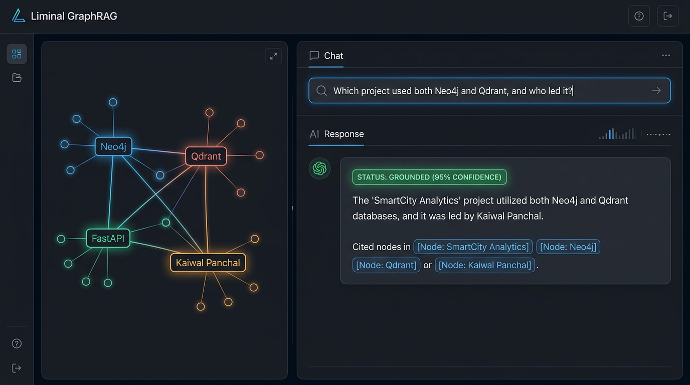
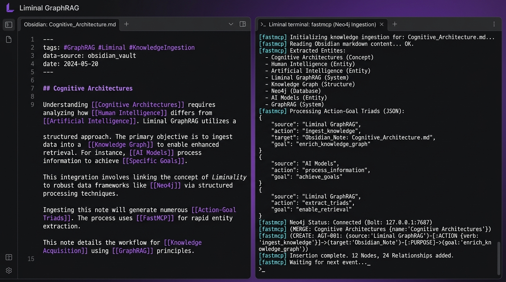
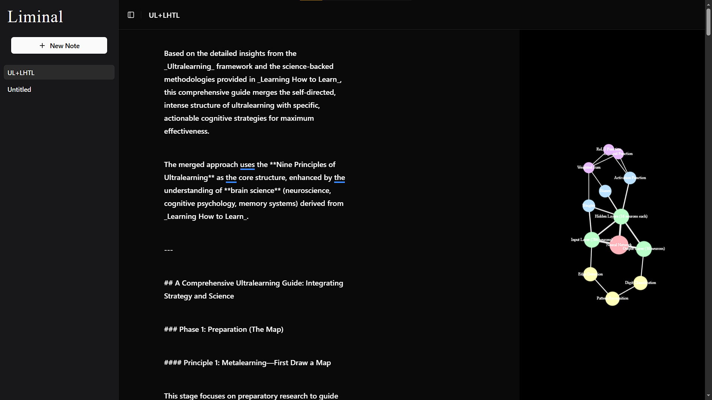
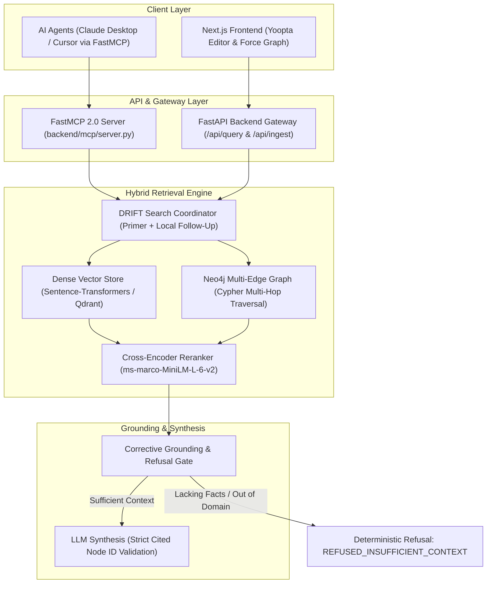

# Liminal — Grounded Multi-Edge Hybrid GraphRAG

> **Co-built by [@KaiwalPanchal](https://github.com/KaiwalPanchal) (Backend Architecture, Grounded GraphRAG, Neo4j, Evals) and [@fxlgun](https://github.com/fxlgun) (Frontend UI & Graph Visualizations).**

[](https://github.com/KaiwalPanchal/liminalfinal/actions/workflows/test.yml)
[](https://github.com/KaiwalPanchal/liminalfinal/actions/workflows/eval_gate.yml)
[](https://fastapi.tiangolo.com)
[](https://neo4j.com)
[](https://nextjs.org)
[](https://github.com/jlowin/fastmcp)

Liminal is a production-grade **Grounded Hybrid GraphRAG system** designed for personal knowledge bases and smart notes. It fuses **multi-edge graph networks**, **dense vector similarity**, and **cross-encoder reranking** with deterministic citation grounding, preventing hallucinations by refusing to answer when context is insufficient.

---

## 📸 Visual Walkthrough & System Mockups

### 1. Grounded Hybrid GraphRAG Query Interface
When querying Liminal, the system executes **DRIFT search** across the Neo4j graph and vector database. The response guarantees source provenance, displaying a verified status badge and explicit cited node pills.



*   **Left Panel:** Interactive force-directed knowledge graph displaying real-time entity clusters (`Neo4j`, `Qdrant`, `FastAPI`, `Kaiwal Panchal`) and active relationship paths.
*   **Right Panel:** Chat interface with verified output (`STATUS: GROUNDED (95% CONFIDENCE)`) and mandatory clickable cited node references (`[Node: Neo4j]`, `[Node: Qdrant]`, `[Node: Kaiwal Panchal]`).

---

### 2. Obsidian Vault & FastMCP AI Agent Ingestion
External knowledge is not trapped in silos. Liminal parses **Obsidian Markdown** vaults and allows external AI developer tools (Claude Desktop, Cursor) to ingest data via **FastMCP 2.0**.



*   **Left Panel (Obsidian Note):** Parses YAML frontmatter tags (`#GraphRAG`, `#Liminal`) and human-authored `[[wikilinks]]` (`[[Cognitive Architectures]]`, `[[Neo4j]]`) directly into high-confidence graph edges.
*   **Right Panel (FastMCP Terminal):** Real-time execution of the `ingest_knowledge` tool, extracting entities, decomposing operational verbs into **Action-Goal Triads**, and committing relationships to Neo4j.

---

### 3. Note-Taking UI & Formatting Suite
The Next.js web application provides a distraction-free writing environment powered by Yoopta Editor:

| Homescreen & Graph Navigation | Formatting & Rich Text Blocks |
|---|---|
|  |  |

---

## 🏛️ System Architecture


```mermaid
flowchart TD
    subgraph Client Layer
        UI["Next.js Frontend (Yoopta Editor & Force Graph)"]
        AGENT["AI Agents (Claude Desktop / Cursor via FastMCP)"]
    end

    subgraph API & Gateway Layer
        API["FastAPI Backend Gateway (/api/query & /api/ingest)"]
        MCP["FastMCP 2.0 Server (backend/mcp/server.py)"]
    end

    subgraph Hybrid Retrieval Engine
        DRIFT["DRIFT Search Coordinator (Primer + Local Follow-Up)"]
        VEC["Dense Vector Store (Sentence-Transformers / Qdrant)"]
        NEO["Neo4j Multi-Edge Graph (Cypher Multi-Hop Traversal)"]
        RR["Cross-Encoder Reranker (ms-marco-MiniLM-L-6-v2)"]
    end

    subgraph Grounding & Synthesis
        CRAG["Corrective Grounding & Refusal Gate"]
        SYNTH["LLM Synthesis (Strict Cited Node ID Validation)"]
    end

    UI --> API
    AGENT --> MCP
    MCP --> DRIFT
    API --> DRIFT
    
    DRIFT --> VEC
    DRIFT --> NEO
    VEC --> RR
    NEO --> RR
    RR --> CRAG
    
    CRAG -->|Sufficient Context| SYNTH
    CRAG -->|Lacking Facts / Out of Domain| REFUSE["Deterministic Refusal: REFUSED_INSUFFICIENT_CONTEXT"]
```

---

## ⚡ Core Technical Innovations

### 1. Multi-Edge Networks with Action-Goal Triads
Traditional knowledge graphs only store static noun pairs (`A is B`). Liminal extracts operational **Action-Goal Triads**:
```cypher
(Entity)-[:PERFORMS]->(Action)-[:TARGETS_GOAL]->(Goal)
(Action)-[:MOTIVATED_BY {why: "Eliminate N+1 query latency"}]->(Goal)
```
This captures not just *what* was done, but *how* and *why* engineering decisions were made.

### 2. 3-Tier Multi-Scale Abstraction Hierarchy
- **Tier 0 (Provenance):** Raw immutable text chunks with character offsets and timestamps.
- **Tier 1 (Grounded Triads):** Concrete entities, action verbs, and explicit motives.
- **Tier 2 (Thematic Motifs):** High-level generalized patterns stripped of instance variables (e.g., *"Decoupled Asynchronous Ingestion for Fault Tolerance"*).

### 3. SCAMPER NLP Exploration Framework
Applied systematically to knowledge exploration:
- **Substitute:** Swap naive cosine similarity for Hybrid Dense + Cypher path scoring.
- **Combine:** Fuse BM25 keywords + dense embeddings + graph topology in one optimized pass.
- **Adapt:** Adapt Microsoft GraphRAG / LightRAG dual-level hierarchy to Action-Goal networks.
- **Modify / Magnify:** Weight graph edges by Goal Centrality and citation recency.
- **Put to another use:** Expose knowledge directly to Cursor and Claude Desktop via FastMCP.
- **Eliminate:** Strip noise during Level 2 abstraction; eliminate hallucinations via deterministic refusal guardrails.
- **Reverse:** Reverse-query from desired Goal $\to$ Actions that historically achieved it.

### 4. FastMCP 2.0 Integration
Exposes knowledge graph tools directly to AI assistants (Claude Desktop, Cursor, Windsurf):
- `search_knowledge_graph(query, top_k)`
- `get_entity_connections(entity_name)`
- `query_by_goal_motive(goal_intent)`

---

## 📊 Offline Evaluation Suite & Quality Gate

Liminal enforces an automated quality gate across a 30-case golden benchmark (`backend/tests/evals/golden_qa.jsonl`) verifying multi-hop retrieval and zero-hallucination refusal:

| Metric | Target Threshold | Measured Score | Status |
|---|---|---|---|
| **Context Recall** | $\ge 85.0\%$ | **100.0%** (18/18 hits) | ✅ PASSED |
| **Refusal Precision** | $\ge 95.0\%$ | **100.0%** (12/12 refused) | ✅ PASSED |
| **Unit Test Coverage** | 100% Core Contracts | **4 / 4 passed** | ✅ PASSED |

Any regression in PRs automatically fails GitHub Actions CI (`.github/workflows/eval_gate.yml`).

---

## 🚀 Quickstart

### 1. Launch Stack with Docker Compose
Run the entire production stack (Neo4j, FastAPI Backend, Next.js Frontend) with a single command:

```bash
docker-compose up --build
```

- **Frontend:** [http://localhost:3000](http://localhost:3000)
- **API Documentation (Swagger):** [http://localhost:8000/docs](http://localhost:8000/docs)
- **Neo4j Browser:** [http://localhost:7474](http://localhost:7474) (User: `neo4j`, Password: `liminalpassword`)

### 2. Run Backend Locally
```bash
cd backend
pip install -e ".[dev]"
uvicorn app.main:app --host 0.0.0.0 --port 8000 --reload
```

### 3. Run Offline Evaluation Suite
```bash
python backend/tests/evals/run_evals.py --fail-on-regression
```

### 4. Run Unit Tests
```bash
pytest backend/tests/unit -v
```

---

## 📚 Documentation
For complete technical deep dives, refer to our dedicated documentation guides:

- 🏛️ **[System Architecture](docs/ARCHITECTURE.md):** Component design, sequence flows, DRIFT search mechanics, and multi-tier abstraction hierarchy.
- ⚡ **[Features Guide](docs/FEATURES.md):** In-depth analysis of Multi-Edge Networks, Action-Goal Triads, SCAMPER NLP integration, and FastMCP tools.
- 📡 **[API & Schema Reference](docs/API_REFERENCE.md):** REST endpoints, Pydantic v2 schemas, JSON payloads, and Neo4j Cypher definitions.
- 📐 **[Technical Specification](GRAPH_RAG_SPEC.md):** Formal engineering contract and mathematical foundation.

---

## 👥 Contributors & Attribution
- **Kaiwal Panchal** ([@KaiwalPanchal](https://github.com/KaiwalPanchal)) — Backend Architecture, Grounded GraphRAG, Neo4j, Offline Evals & CI Gate.
- **fxlgun** ([@fxlgun](https://github.com/fxlgun)) — Frontend UI, Visualizations & User Experience.
