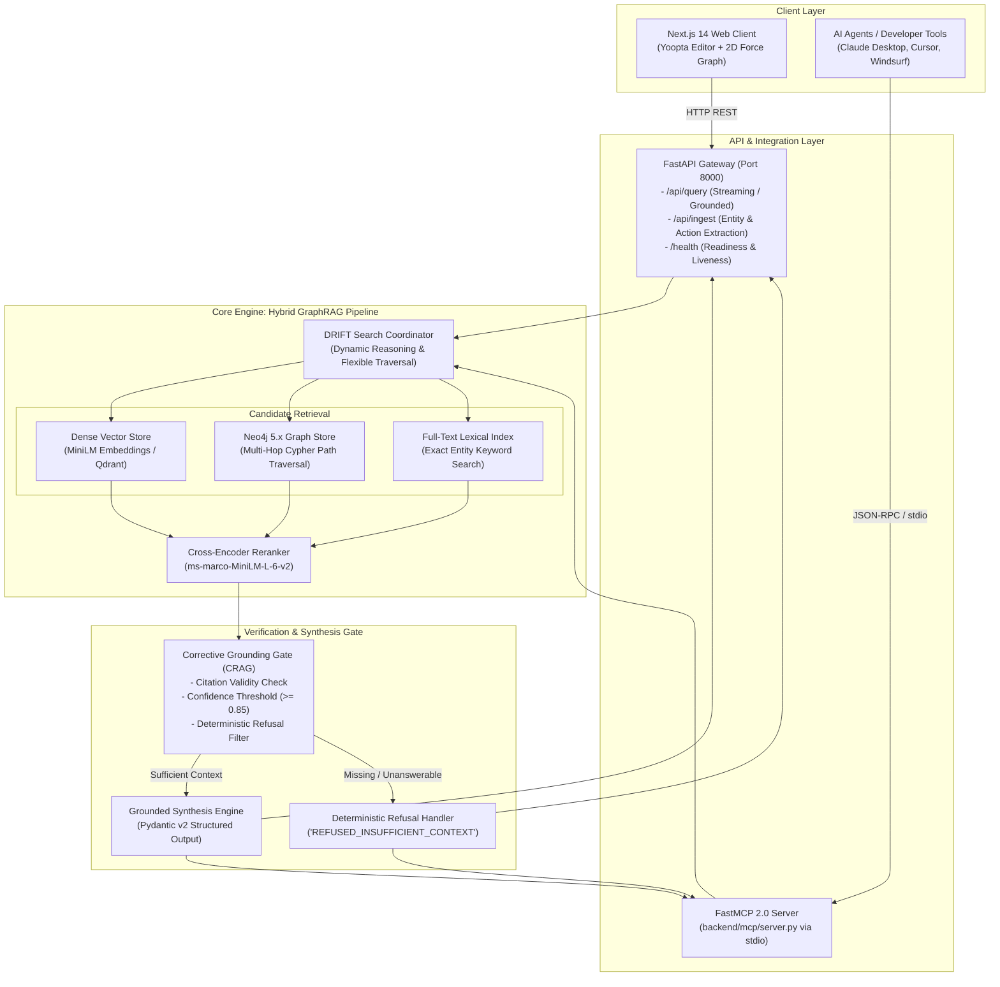
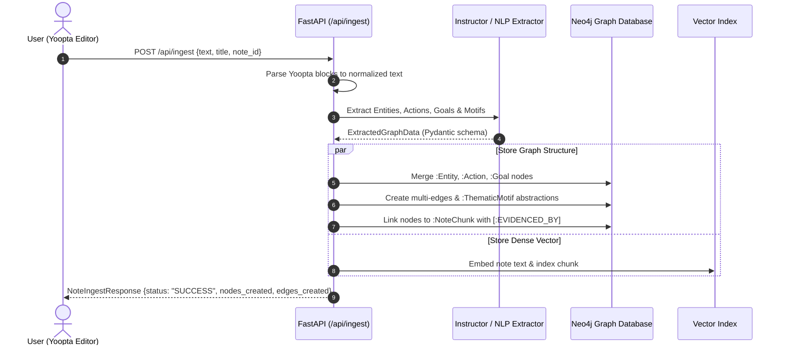
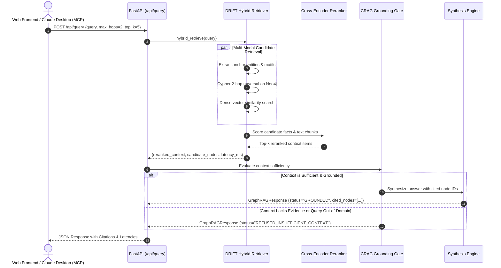
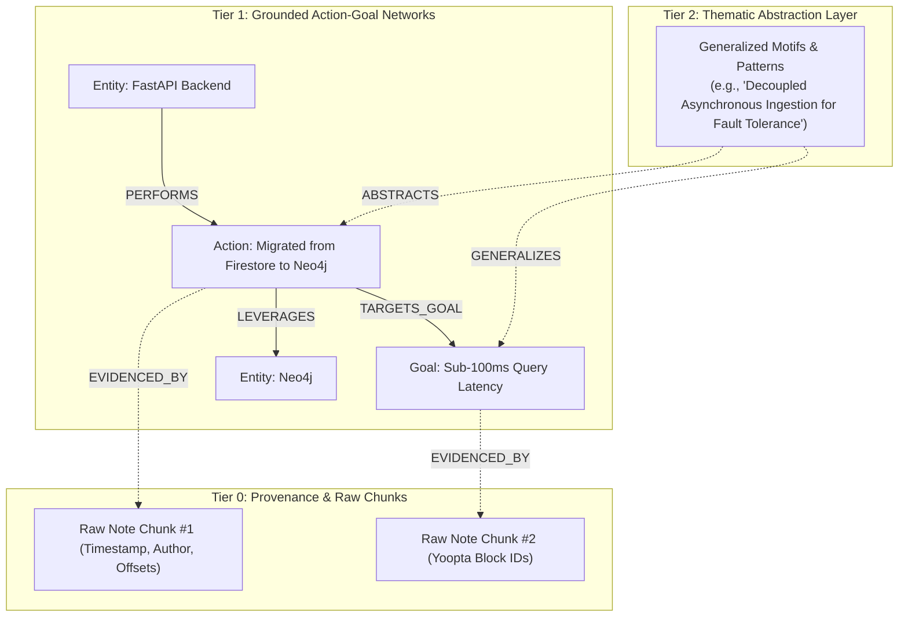

# Liminal System Architecture

This document provides a comprehensive technical overview of the **Liminal Grounded Hybrid GraphRAG** architecture, detailing component interactions, retrieval mechanics, graph data modeling, and grounding guardrails.

---

## 1. High-Level Architecture Diagram



---

## 2. Component Breakdown

### 2.1 Client Layer
*   **Next.js 14 Frontend:** React-based single-page application using App Router, Tailwind CSS, and shadcn/ui components.
*   **Yoopta Editor:** Block-based rich text note editor allowing headings, code blocks, lists, and callouts.
*   **2D Force Graph Visualizer:** Built on `react-force-graph` to visually render nodes, relationships, and cluster topologies in real time.
*   **FastMCP Agent Interface:** Implements the Model Context Protocol (MCP) to allow developer agents (such as Claude Desktop or Cursor) to call Liminal graph tools directly.

### 2.2 API & Gateway Layer (`backend/app/`)
*   **FastAPI Framework:** High-performance asynchronous Python API gateway.
*   **Pydantic v2 Models:** Enforces strict serialization, validation, and type contracts across all incoming requests and outgoing responses.
*   **Lifespan Management:** Initializes and monitors database connections on application startup and ensures graceful cleanup on shutdown.

### 2.3 Knowledge Graph Store (Neo4j 5.x)
*   **Multi-Edge Graph Network:** Supports multiple concurrent, typed relationships between entities (e.g., `(A)-[:USES_FOR]->(B)` alongside `(A)-[:COLLABORATES_WITH]->(B)`).
*   **Action-Goal Triads:** Native storage of operational actions, outcomes, and motivations (`PERFORMS`, `TARGETS_GOAL`, `MOTIVATED_BY`).
*   **Constraints & Full-Text Indexes:** Unique node identity constraints on entity names and chunk IDs; full-text search indexes on node labels for fast lexical lookups.

### 2.4 Hybrid Retrieval & DRIFT Search (`backend/app/rag/`)
Liminal implements **DRIFT Search** (Dynamic Reasoning and Inference with Flexible Traversal), which balances thematic breadth and local depth:
1.  **Primer Stage (Thematic Matching):** Examines Level 2 `:ThematicMotif` nodes and community clusters to determine the broad conceptual domain of the query.
2.  **Follow-Up Stage (Action-Goal Traversal):** Extracts anchor entities from the query and performs a 1–2 hop Cypher traversal:
    ```cypher
    MATCH (e) WHERE toLower(e.name) IN $names
    OPTIONAL MATCH path = (e)-[r*1..2]-(neighbor)
    UNWIND relationships(path) AS rel
    RETURN startNode(rel).name AS source,
           labels(startNode(rel))[0] AS source_type,
           type(rel) AS relation,
           endNode(rel).name AS target,
           labels(endNode(rel))[0] AS target_type,
           rel.details AS details
    LIMIT 50
    ```
3.  **Dense Vector Search:** Simultaneously matches query embeddings against text chunks in the vector index.
4.  **Cross-Encoder Reranking:** Concatenates graph facts and vector passages into a candidate pool, re-scoring them using a neural cross-encoder (`cross-encoder/ms-marco-MiniLM-L-6-v2`).

### 2.5 Corrective Grounding & Refusal Gate (`backend/app/rag/generator.py`)
To prevent hallucinations, Liminal implements a **Corrective RAG (CRAG)** verification gate prior to answer generation:
*   **Factual Alignment Verification:** Checks whether key entity tokens from the query exist in the reranked context.
*   **Adversarial & Out-of-Domain Filter:** If the query requests facts not present in the graph (e.g., external budgets, private credentials, unrelated trivia), the gate short-circuits.
*   **Deterministic Refusal:** If confidence $< 0.85$ or factual support is missing, the system returns:
    ```json
    {
      "answer": "REFUSED_INSUFFICIENT_CONTEXT: The knowledge graph does not contain verified relationships or passages for this query.",
      "status": "REFUSED_INSUFFICIENT_CONTEXT",
      "confidence_score": 0.1,
      "cited_nodes": []
    }
    ```
*   **Strict Citation Contract:** When grounded, every factual statement in the answer must cite corresponding verified node IDs (`cited_nodes`).

---

## 3. Data Flow & Sequence Diagrams

### 3.1 Note Ingestion Flow



### 3.2 Query & Synthesis Flow



---

## 4. Multi-Scale Abstraction Hierarchy

Liminal structures stored knowledge across three distinct tiers:



1.  **Tier 0 (Provenance):** Raw, immutable text chunks preserving exact wording, character offsets, timestamps, and authorship.
2.  **Tier 1 (Grounded Triads):** Concrete entities, operational action verbs, and explicit goals directly extracted from notes.
3.  **Tier 2 (Thematic Motifs):** High-level architectural or conceptual patterns stripped of situational variables, enabling cross-project discovery.

---

## 5. Security & Deployment Architecture

*   **Docker Containerization:** All components (Neo4j 5.x, FastAPI Backend, Next.js Frontend) are containerized and orchestrated via `docker-compose.yml`.
*   **Zero Hardcoded Secrets:** Configuration is managed strictly via environment variables (`.env` with `.env.example` template).
*   **Network Isolation:** Neo4j and internal microservice communication runs on an internal Docker network, exposing only ports 3000 (Frontend), 8000 (Backend API), and 7474/7687 (Neo4j Browser/Bolt) as required.
